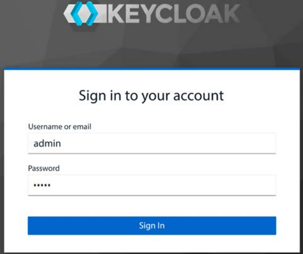
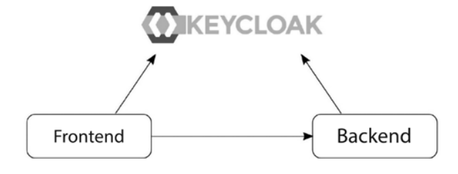
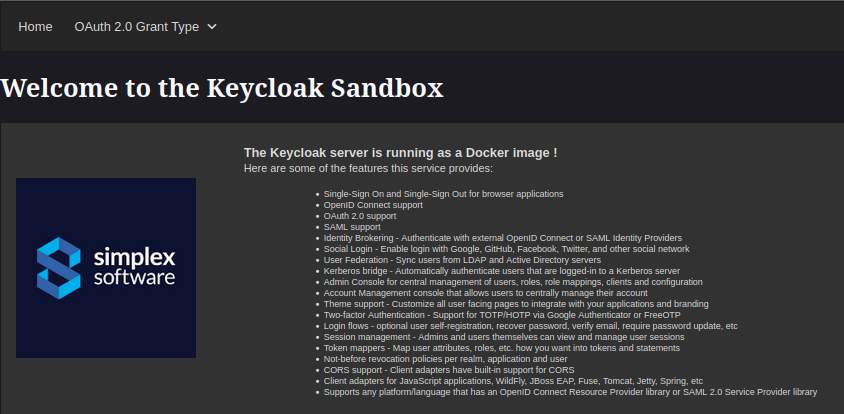
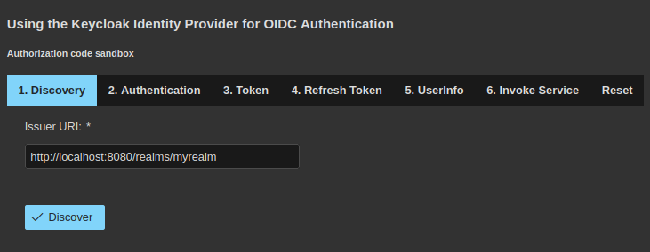
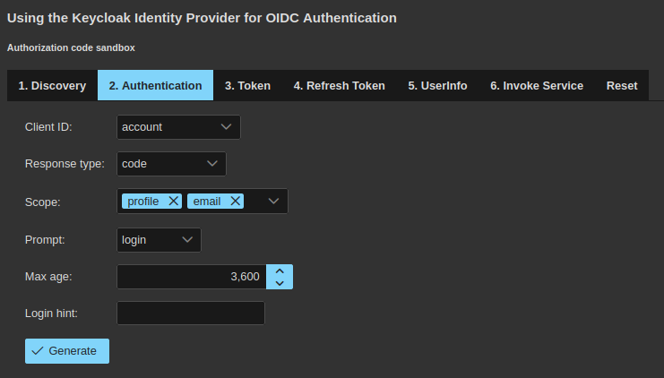
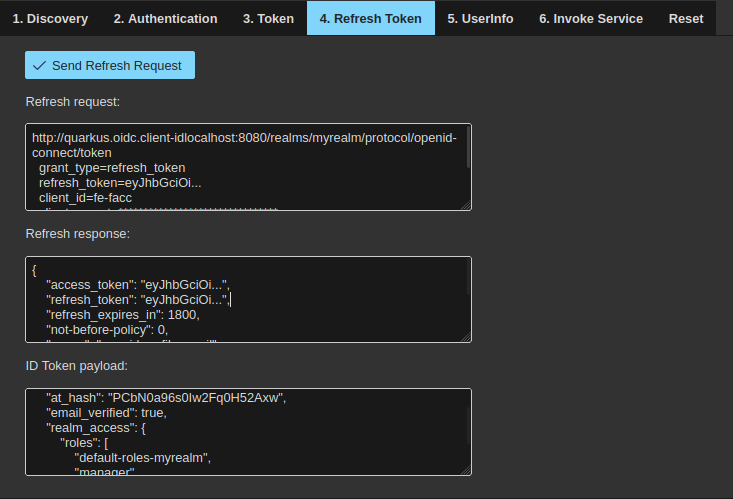
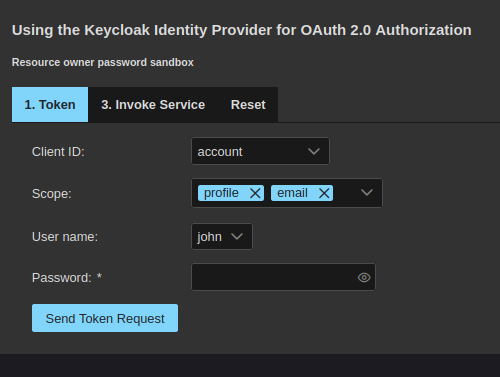
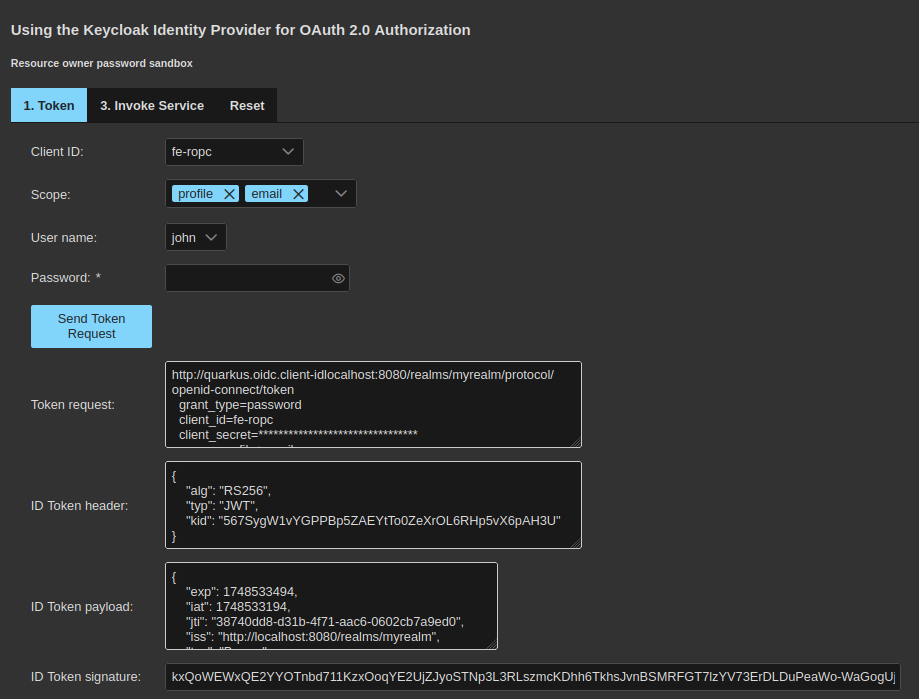
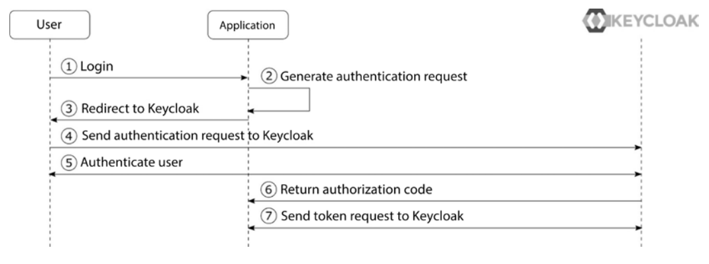
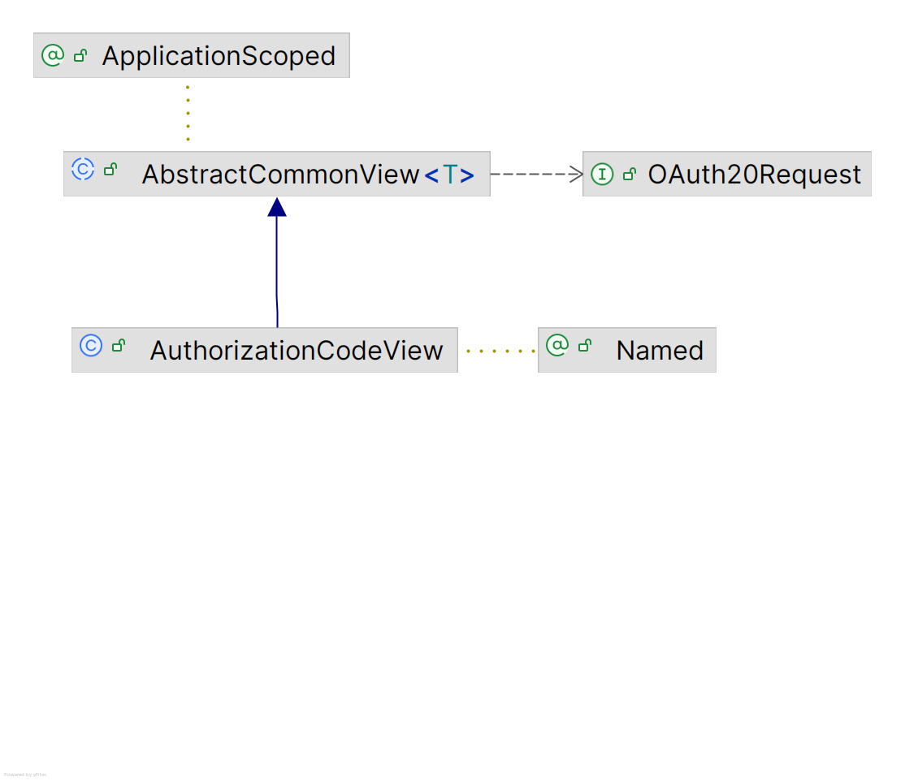

# SaC It Up: Dive Deep into DevSecOps with Java, Quarkus and Keycloak

In the ever advancing world of software industry, code and security often 
feel like antagonistic vectors. But what if security could move at the pace of code ?
Enter *Security as Code* (SaC): the next phase of the DevSecOps evolution. By 
including security rules, expectations and policies directly into the development lifecycle,
SaC shifts security left, turning traditionally manual and repetitive tasks into
automated, version-controlled artifacts. This isn’t just a technical upgrade 
but a cultural change where developers, security teams, and operations speak the
same language: code. 

Whilst software delivery pipelines progressively become automated, making security
an integral part of the code isn't anymore a best practice, but a necessity. From
this perspective, SaC is considered as being the
natural progression of DevSecOps. Addressing security strategies, controls and policies
as development artifacts which could be tested, audited and versioned, just like infrastructure
and application code, not only scales better but also ensures security
is enforced consistently across environments and teams.

In this article, we’ll explore how SaC allows DevOps and DevSecOps teams to build fast, 
to ensure appropriate security and to trustfully scale in modern cloud-native environments
based on Java, Quarkus and Keycloak platforms.

## From DevOps to SaC: a short piece of history

The term of DevOps, as a contraction of "Development" and "Operations", emerged
in the late Y2K as a response to the traditional software development process, 
where development and IT operations were often disconnected. It aimed at breaking
down barriers between development and operations teams such that to favorize faster
deployment cycles, increased collaboration and automation of the software delivery
process through CI/CD platforms.

However, in these early days of DevOps, security was often an afterthought. Traditional
security practices were manual and slow, to such an extent that they became a bottleneck
in the DevOps process and in the whole development lifecycle. Starting with 2012, 
organizations realized that security had to be integrated into the DevOps workflow.
The core idea was to "shift left security", i.e. bringing it earlier in the 
development process. A couple of years later, in 2015, the term of DevSecOps was
coined, standing for "Development, Security and Operations", as it brought security
as a shared responsibility across these three fields.

DevSecOps transformed security, from a separate team post-deployment concern, into
an embedded from start, shared responsibility. IaC (*Infrastructure as Code*) was
one of the most important approaches to inforce DevSecOps practices, by using the
programming languages power in order to automate security startegies, configurations
and policies. And since a continuously increasing part of the IaC was dedicated
to make security repeatable, scalable and version-controlled, this part finished
by becoming a separate discipline in itself and was named *Security as Code* (SaC). 

Today SaC is considered as being the next logical maturity step for organizations
already having embraced DevSecOps. As a matter of fact, if DevSecOps made security
collaborative and brought it in the earliest stages of the development lifecycle, 
SaC makes it reliable, scalable and automated.

## The IAM Service: a must-have for any SaC platform

During the software development evolution from DevOps to DevSecOps and then to SaC,
the requirements around *Identity and Access Management* (IAM) services evolved as well.
Once a secondary concern handled by infrastructure or external providers, IAM services became
gradually first-class citizens of the development lifecycle, driven by the need for automated,
auditable, and scalable security. 

With IaC permitting the automated deployment of infrastructure at scale, managing
who can access what within these systems becomes more complex and more critical.
This is where IAM comes into the picture, providing the foundation for secure, role
based control across cloud-native environments. In this context, IAM has become
an essential service of the infrastructure automation,
ensuring that only the right users, services, and machines have access to the
right resources. 

With the growth of DevSecOps and IaC, development teams have started more and 
more to get into the habit of including security policies and controls earlier 
in the development process. This implied to delegate authentication and authorization
to centralized IAM platforms. By leveraging standards like OpenID Connect (OIDC)
and OAuth 2.0, these platforms allowed developers to offload security logic from
applications while still maintaining strict control over access policies. However,
manually configuring IAM, as it was often the case, used to dramatically limit 
its scalability and its repeatability.

SaC was the critical point at which IAM configurations were no longer manually 
managed but instead treated as code. Among the many IAM available solutions, 
Keycloak, a RedHat open-source identity server, stands out as a powerful platform
designed to provide centralized authentication and authorization for modern 
applications. With tools like Keycloak, teams can now codify realms, clients, 
roles, and access policies, store them in version control, and deploy them automatically
using tools like Terraform, Ansible or Helm. This approach makes IAM a fully 
integrated, testable, and repeatable infrastructure element which guarantees 
consistent and traceable security across environments.

Keycloak’s extensive support for automation makes it an ideal candidate for IaC.
Its CLI, REST API, and declarative configuration import / export feature allow
organizations to enforce zero-trust principles, enable fine-grained access control,
and maintain compliance, by incorporating Keycloak configurations into the broader 
DevSecOps toolchain, without sacrificing development speed. This integration
ensures that identity policies evolve with the application, not as an afterthought
but as a core part of the software lifecycle.

## Introducing Keycloak

Keycloak is a IAM server dedicated to supply identity services to modern applications
such as SPA (*Single Page Application*), mobile applications or REST APIs. Started
at RedHat in 2014 as an open-source project, it has grown little by little into
a well recognized product, with a solid community and a strong user base.

Keycloak supports industry standard protocols like OAuth 2.0, OpenID Connect
and SAML 2.0, this way allowing the developers to disregard the necessity of 
mastering the full complexity of the authentication and authorization process,
by delegating its responsibility to the server, while guaranteeing a high security
level to applications that don't have access to the users' credentials.

It is important to mention also that Keycloak provides a wide range of authentication
mechanisms, including but not limited to MFA (*Multi Factor Authentication*), 
SA (*Strong Authentication*), using OTPs (*One Time Password*), security devices,
WebAuthn passwords or a combination of them all. Thanks to its session management
capabilities, Keycloak is an SSO (*Single Sign On*) service as well, allowing 
users to access several applications, while only having to authenticate once.

As any IAM server, the notion of user is central to Keycloack but, as opposed to
other IAM servers, Keycloak comes with its own user database. For simplicity's 
sake and in order to avoid possible licensing issues, this default database is 
a very simple H2 file-based one that shouldn't be used in production. Instead,
any other production-ready database, like Oracle, PostgreSQL, MySQL, MariaDB, 
etc., may be configured. Additionally, Keycloak provides a strong caching layer
designed to avoid database hits as much as possible. And as the vast majority 
of organizations uses LDAP directories as their single source
of truth for user management and digital identities. Consequently, Keycloak 
supports integration with different LDAP directory implementations like Microsoft
Active Directory, RedHat Directory Server, ApacheDS, OpenLDAP, etc.

## SaC and Keycloak

While Keycloak itself is not SaC tool, the way to manage and deploy it and its 
configurations can absolutely become part of a SaC strategy. Its extensive support
for automation through its CLI, REST API and declarative import/export makes 
it an ideal platform for SaC. Here are the most essential criteria showing how 
Keycloak fits into SaC:

1. Configuration as code.
  - Defining realms, clients, roles, users, identity providers, etc. using the `kadm` scripts and storing these scripts in GIT repositories.
  - Defining realms, clients, roles, users, identity providers, etc. ind JSON or YAML files, storing these files in GIT repositories and importing them using the `kadm` tool. 
  - Exporting Keycloak realm configurations as JSON files, storing them in GIT repositories and re-import them during deployments.
2. Automated deployment.
  - Using OCI (*Open Container Initiative*) compliant images to run Keycloak and dynamically apply configurations described by versioned scripts or JSON/YAML files.
  - Using tools like Terraform, Ansible, Helm or Kubernetes Operators to deploy and configure Keycloak.
3. Programmatic access policies.
  - Using RBAC (*Resource Based Acces Control*) policies as JSR 250 annotations in versioned Java code.
  - Using RBAC (*Resource Based Acces Control*) policies as versioned JSON files.
4. CI/CD integration.
  - Using CI/CD pipelines to automatically test and deploy security artifacts.
  - Making security repeatable, auditable and scalable.

One of the most classical scenario of implementing SaC with Keycloak would probably
include the use of `kadm` versioned scripts to create OAuth 2.0 clients, users, 
groups, roles, authentication flows, authorization policies, etc. and automatically
applying them using OCI complinat images or tools like Terraform, Ansible, Helm
or Kubernetes Operators. However, doing the same thing by manually clicking around
the Keycloak administration console without versioning and documenting these 
one-off changes, would *not* be SaC.

## Running Keycloak

While Keycloak may be installed locally, like any other software, by downloading
and uncompressing it, the easiest way to run it is as an OCI compliant image.

Here is how you can run it as a Docker image:

    $ docker run -d --name keycloak \
        --rm -e KEYCLOAK_ADMIN=admin \
        -e KEYCLOAK_ADMIN_PASSWORD=admin \
        -p 8080:8080 quay.io/keycloak/keycloak:latest start-dev

This command will pull the Docker image `quay.io/keycloak/keycloak:latest` from
the RedHat repository and, if it isn't already present locally, it will store it
there. Then, the Docker daemon will run it in the background (option `-d`), listening 
for HTTP trafic on the container TCP port 8080, mapped on the same TCP port of 
the host (option `-p`). The temporary administrator user name, as well as the 
associated password, are `admin` (options `-e KEYCLAOK_ADMIN` and 
`-e KEYCLOAK_ADMIN_PASSWORD`). Ultimately, the name of the running container 
is `keycloak` (option `--name`) and, when the Docker container is stopped,
the associated image will be removed (option `--rm`).

You can check that everything is working as expected by executing the following
command:

    $ docker images
    REPOSITORY                     TAG               IMAGE ID       CREATED        SIZE
    ...
    quay.io/keycloak/keycloak      latest            152827b20b9e   2 months ago   443MB
    ...

The output above shows that the Docker image `quay.io/keycloak/keycloak:latest`
was pulled and installed locally.

    $ docker ps
    CONTAINER ID   NAMES      IMAGE                              PORTS                                        STATUS
    ...
    ded779e9c153   keycloak   quay.io/keycloak/keycloak:latest   8443/tcp, 0.0.0.0:8080->8080/tcp, 9000/tcp   Up 6 seconds
    ...

Here you can see that the Docker container named `keycloak` is up and running.
You can see its log file as shown below:

    $ docker logs keycloak --details --follow 
    Updating the configuration and installing your custom providers, if any. Please wait.
    ...
    2025-05-15 16:06:34,954 INFO  [io.qua.dep.QuarkusAugmentor] (main) Quarkus augmentation completed in 6489ms
    Running the server in development mode. DO NOT use this configuration in production.
    ...

Last but not least, firing your prefered browser at http://localhost:8080 and 
connecting as `admin/admin` to the login dialog shown below:

will allow you to get acces to the Keycloak 
administration console. This proves that your IAM server is fully operational.

## Getting started with Keycloak CLI

As already mentioned above, Keycloak comes with an administration console which
allows you to configure and manage the IAM server. But using this administration 
console wouldn't be a SaC compliant approach because, whatever you do with it:

  - isn't repeatable;
  - isn't deterministic;
  - isn't versionable;
  - isn't auditable;
  - isn't documented;
  - is repetitive;
  - is error prone.

So, here is where the Keycloak CLI (*Command Language Interpreter*) comes into he play.

The Keycloak CLI consists in a `bash` script named `kadm.sh`, found in the `bin`
directory of the server. Therefore, you can run it as follows:

    $ export PATH=$PATH:$KEYCLOAK_HOME/bin
    $ kcadm.sh

Using this script, you can do whatever you do by clicking around the administration
console, but in a controled and fully SaC compliant mode. Let's have now a quick 
overview of the most essential Keycloak concepts:

  - **Realms**. A realm is a logical namespace grouping different security artifacts like applications, services, users, groups, roles, etc. They are isolated from one another and can only manage the artifacts that they control.
  - **Clients**. Before applications are able to use Keycloak services, they need to be registered first, as Keycloak clients. They represent basic entities that may request Keycloak authentication and authorization.
  - **Users**. The notion of users is the same as with any other kind of server, i.e. entities able to log with Keycloak. They are stored in the Keycloak internal datrabase or, in the case of the users federation, in external LDAP directories. Users belong to and log into realms.
  - **Groups**. Users can be grouped in user groups. This facilitates the management of their common attributes.
  - **Roles**. Roles are permission types that can be defined at either the realm or the client level. They are assigned to specific users or user groups.
  - **Role mappers**. These Keycloak artifacts are used in order to assign roles, i.e. sets of permissions, to specific users or user groups.

Now that we got a basic understanding of the most important Keycloak artifacts,
let's dive into the writing of `kcdm` scripts that handle them. The first thing 
to do when starting using Keycloak as a security provider is to create a new 
realm. Here are the required steps:

### Configure the temporary admin credentials.

Keycloak comes with an already configured security realm named `master`. As its 
name implies, it the master of realms, the place where the server administrators
create their accounts allowing them to manage any other realm created on the same
server instance. So, it is used by the server itself and, while you can use it to
manage your own realm, this isn't recommended.

When Keycloak is installed on-prem and, hence, an installation and configuration
process has been executed, the server comes with a default administrator in the
`master` realm. The default credentials for this administrator are `admin/admin`.
This isn't the case when Keycloak is run as an OCI compliant image and, in this
case, the first thing to do before getting access to the `master` realm, is to 
set up its temporary credentials. With Keycloak CLI, this can be done using the
following command:

    $ kcadm.sh config credentials \
       --server <server-url> \
       --realm master \
       --user <user-name> \
       --password <user-password>

Of course, this command can only be executed once that the Keyclaok server has 
started. Here `<server-url` is the full URL of the Keycloak server, for example
http://localhost:8080, while the options `--user` and `password` enable you to 
define the user name and, respectivelly, the associated password of the `master`
realm administrator.

### Creating a new realm

Having defined these temporary credentials, you can now create a new realm:

    $ kcadm create realms -s realm=<realm-name> -s enabled=true

Here the `-s` option, for `set`, allows you to set up attributes values. In this
case we're creating a new realm which name is defined by the `-s realm` option 
and, since realm aren't enabled by default, we need to do it using the argument
`-s enabled=true`.

### Creating users

Now is the time to create the Keycloak users. 

    $ kcadm.sh create users \
       -r <realm-name> -s \
       -- username=<user-name> \
       -s enabled=true \
       -s "emailVerified=true" \
       -s "email=<user-email>" \
       -s "firstName=<user-first-name>" \
       -s "lastName=<user-last-name>"
    $ kcadm.sh set-password -r <realm-name> \
        --username <user-name> \
        --new-password <user-password>

The sequence above creates a new user in the newly created realm and defines the
associated password. To be noted that users have several properties like their 
associated first and last name, as well as their email address. These properties
are initialized on the behalf of `-s "name=value"` options. Also, the boolean 
property `emailVerified` helps to define trusted users, which email address has
been verified after their creation.

### Creating clients

Creating clients is a more complicated operations due to the large number of 
properties and parameters that need to be defined. This is why, in practice,
all these parameters and properties are stored in JSON files that are used as 
input for `kcadm` commands. Here is an example:

    $ kcadm create clients -r <realm-name> -f <input-file>

In this example, `<input-file>` is the full path of a local JSON file containing
the description of the new client that has to be created. We'll come back later
with more details concerning the client types as well as their properties.

### Creating roles and assigning them to users

In order to assign permission to users, we're using Keycloak roles. These roles
can be assigned, as explained, to users, in which case we're talking about realm
roles, or to clients. Here is an example of creating a new realm role and to 
assign it to an user:

    $ kcadm create roles -r <realm-name> -s name=<role-name>
    $ kcadm add-roles --uusername <user-name> --rolename <role-name> -r <realm-name>

The sequence above creates a new role which name is defined by the option 
`-s name=<role-name>` in the realm which name is defined by the option `-r <realm-name>`.
Then, this role is assigned to the user which name is defined by the option 
`--uusername <user-name>`.

Once we complete these steps above, we can consider having a new realm, quite 
complete, providing all the required artifacts, which should allow us to run 
the sample application, as shown in the next section. Of course, the mentioned
steps don't have to be executed manually, but we'll demonstrate how to automate
them, in the most authentic SaC way, using tools like `docker` and `docker-compose`,
integrated with Quarkus.

## Getting started with the sample application.

In order to illustrate all the concepts introduced above, we provide a sample 
application, available here: https://github.com/nicolasduminil/iam.git.
It's a Java application, using Quarkus, the famous supersonic and subatomic stack.
It consists of several Maven modules or subprojects, as follows:

  - The `front-end` Maven module which deploys a web application which uses the Jakarta Faces and PrimeFaces extension for Quarkus.
  - The `back-end` Maven module which exposes a simple REST API invoked by the `front-end` module.
  - The `infra` Maven module which orchestrates the others ones, including the Keycloak server.

Let's look in a greater detail at each one of hese modules.

### Technical requirements

The sample application is a Java application, accordingly you need to have Java
21 or later installed on your box. You could use different Java versions but, in
this case, you need to slightly modify the master `pom.xml` file such that to 
align with your Java version.

You also need to have a local copy of the GitHub repository associated with the
project. If you have Git installed, you can clone the repository by running this
command in a terminal:

    $ git clone https://github.com/nicolasduminil/iam.git

Alternatively, you can download a ZIP of the same repository mentioned above.

The sample application is using Keycloak as a IAM service, accordingly you need
to have it running, either by downloading and installing it, or by running it 
as an OCI compliant image, using Docker, Podman or any other tool you prefer.
Here, we're using Docker and, consequently, if you want to run the sample application
exactly as it is, you need a local Docker infrastructure.

And since we're using Maven as our build engine, you need to have it installed
as well.

### Understanding the sample application

The sample application consists of two parts: a frontend web application and a 
backend REST API.
The frontend web application is a classical web application, written in Java, 
with Quarkus and the PrimeFaces extension for Quarkus.

> **_NOTE:_**  The fact of having written the web application in Java, with 
> PrimeFaces, which is an implementation of the Jakarta Faces specifications, 
> might be surprising. As a matter of fact, it would have been more usual to 
> write it in a JavaScript library, like Angular, Vue.js, etc. 
> The reason we did it this way is that Jakarta Faces is a great web framework 
> whose implementations offer hundreds of ready-to-use widgets and other visual
> controls. Compared with Angular, where the visual components are a part of 
> external libraries, like Material, NG-Bootstrap, Clarity, Kendo, Nebular, and
> many others, Jakarta Faces implementations not only provide ways more widgets
> and features, but also are part of the official JSR 372 specifications and, 
> in this respect, they are standard, as opposed to the mentioned libraries, 
> which evolve with their authors prevailing moods, without any guarantee of 
> consistency and stability.
> For more arguments in choosing Jakarta Faces implementations for web applications
> please see my article on DZone: https://shorturl.at/Iv01O.

As we want to focus on the features that Keycloak, as an enterprise IAM service,
can offer, the sample application is very simple. Furthermore, to make it as simple
as possible to run it, we're using Quarkus.

The web application demonstrates the following features:

  - It uses the Keycloak `discovery` endpoint.
  - It uses the OAuth 2.0 `authorization code` grant type.
  - It uses the OpenID Connect to obtain an ID token for the given `authorization code`.
  - It uses the OpenID Connect protocol to login against the Keycloak service.
  - It shows the ID and the access token.
  - It refreshes of the access token.
  - It invokes the userinfo Keycloak endpoint and displays the required data.
  - It invokes the public and the secured backend endpoint using the RBAC (*Role Based Access Control*).

The backend REST API is also very simple and is implemented with Quarkus as well.
It provides a REST API with two endpoints:

  - `/public`: A publicly available endpoint with no security
  - `/secured`: A secured endpoint requiring an access token with the myrealm global role

Using Quarkus with its embedded Undertow web server allows to make the code as 
easy to understand and as simple to run as possible for anyone familiar with the
Java programming language. The following diagram shows the relationship between
the frontend, the backend, and the Keycloak service. The frontend authenticates
the users against the Keycloak server and then invokes the backend, which uses 
the Keycloak defined roles such that to validate the RBAC request:

Now  let’s look at some more details on how all these pieces come together.

### Running the sample application

In order to run the sample application, once you cloned the GitHub repository 
associated with the project, all you need is to execute the following Maven 
command:

    $ cd <app-directory>
    $ mvn clean install

Of course, if that's the first time you're running the sample application, then
yoi don't need the clean verb. You'll see a whole crowd of Maven output lines 
and, if everything is okay, you'll see the following build process result:

    [INFO] IAM :: The Master POM .............................. SUCCESS [  0.258 s]
    [INFO] IAM :: The Doamain Module .......................... SUCCESS [  1.433 s]
    [INFO] IAM :: The Common Module ........................... SUCCESS [  0.760 s]
    [INFO] IAM :: The Back-End Module ......................... SUCCESS [ 13.560 s]
    [INFO] IAM :: The Front-End Module ........................ SUCCESS [ 12.560 s]
    [INFO] IAM :: The Infrastructure Module ................... SUCCESS [ 40.865 s]
    [INFO] ------------------------------------------------------------------------
    [INFO] BUILD SUCCESS
    [INFO] ------------------------------------------------------------------------

The durations shown above might be different in your case. Now, you can start the
`front-end` application by firing your preferd browser at http://localhost:8082.
You should see the following welcome screen:

I took the greatest care and attention while designing the `front-end` such that
not only to showcase the Keycloak most important features, but also to demonstrate
the suitability of the Jakarta Faces compliant implementations, in this case 
PrimeFaces, for UI based applications. And as you'll see later when we'll examine
the `front-end` details, this specification, together with its implementations, 
provides a way more robust architecture than the one offered by any JavaScript 
based libraries.

So, let's start now exploring this UI. A menu available in the menu bar allows 
you to select the desired OAuth 2.0 grant type and proposes the following options:

  - authorization code;
  - resource owner password;
  - client credentials.

First, you need to know that the OAuth 2.0 protocol defines *grant types* as 
being standardized methods that define how a client application can obtain 
authorization to access protected resources. They represent different flows 
through which an application can receive an access token to act on the behalf 
of an user. The RFC 6749 (https://datatracker.ietf.org/doc/html/rfc6749) 
provides all the required details.

So, our sample application allows you to exercice all these grant types. To 
beggin, hover your mouse over the menu labeled `OAuth 2.0 Grant Types` and select
the first menu item named `Authorization code`. You'll see the following dialog
box in the lower part of the screen:

As you can notice, several ordered steps are proposed to you, in the manner of 
a simplified workflow. Start by the first one labeled `Discovery` and click on 
the button having the same name. A new input text area will be displayed, containing
all the functional endpoints proposed by the Keycloak server. 

The `Discovery` function is an optional specification that an OAuth 2.0 provider
can decide if it wants to implement or not. This idea comes from the necessity 
to associate REST endpoints to the OAuth 2.0 standard features. Instead of 
defining these endpoints at the specification level, which would certainly weigh
them down a lot, the implementors are free to craft them how they want. And since
they would be different from an implementation to another one, the server has to
provide the `Discovery` endpoint which, when invoked, will return all the other 
endpoints attached to OAuth 2.0 standard operations. 

In our case, you can find in the new displayed input text area control labeled
`Keycloak OpenID Connect provider configuration`, the following entries:

  - `authorization_endpoint`: the URL to use for authentication requests; 
  - `token_endpoint`: the URL to use for token requests; 
  - `introspection_endpoint`: the URL to use for introspection requests; 
  - `userinfo_endpoint`: the URL to use for UserInfo requests; 
  - `grant_types_supported`: the list of supported grant types; 
  - `response_types_supported`: the list of supported response types;
  - etc.

Spend a short moement to scroll down among the endpoints that the Keycloak server
makes available and that the `Discovery` returns as metadata. Then, continue with
the next step of our workflow and click on the `Authentication` tab.The following
dialog box will display:

Here you need to provide all the information for the use of the `authorization
code`grant type. We'll come back with finer details concerning this grant type,
and all the others, for now just proceed as follows:

  - in the combo list box labeled `Client ID` select `fe-facc`; this is the ID of the Keycloak client on the purpose prepared for this kind of gran type (more on that later);
  - select `code`, if not already selected, in the combo list box labeled `Response type`;
  - accept the default value of `profile email` for the combo check box labeled `Scope`; the scope `OIDC` is mandatory for Keycloak so it will be added automatically;
  - accept the default value of `login` for the combo list box labeled `Prompt`;
  - accept the default value of `3600` for the input text contrl named `Max age`;
  - keep empty the input text control labeled `Login hint` or, if you prefer, you could type in `john`, which is the user name you need to use for authentication purposes.

Now click on the `Generate` button and the following HTTP request will appear in
the input text area labeled `Authorization request`:

    http://quarkus.oidc.client-idlocalhost:8080/realms/myrealm/protocol/openid-connect/auth
      client_id=fe-facc
      redirect_uri=http://localhost:8082/callback
      scope=profile+email+openid
      response_type=code
      prompt=login
      max_age=3600

This allows you to better understand how the `authorization code` grand type 
works. Please notice that the `quarkus.oidc.client-idlocalhos` host name above
is the name associated by the DNS (*Domain Name Service*) to `localhost`.

Now, that you have seen what the `authorization code` request looks like, send 
it by clicking the `Send authorization request` button. At this point, the 
Keycloak service will take the helm and will display the login dialog. Type `john`
as the user name and `password1` as the password. The authentication process 
against the Keycloak service should succeed and you should see now the response
to the `authorization code` request. It's a very long character string without any
particular mening other the the ability to be exchanged against an ID token.

Now, click on the `Token` tab and, in the new displayed dialog box, click on 
the `Send token request` button. You'll be presented with three input text areas,
the first of which will contain the following HTTP request sent to the Keycloak 
server in order to obtain the access token:

    http://quarkus.oidc.client-idlocalhost:8080/realms/myrealm/protocol/openid-connect/token
      client_id=fe-facc
      redirect_uri=http://localhost:8082/callback
      scope=email+profile+openid+openid
      client_secret=********************************
      code=a647bb3d-3...

Please notice the token endpoint which is `realms/myrealm/protocol/openid-connect
/token`. The `authorization code` provided in the request under the `code` parameter
has been truncated since it is too long and irelevant foe humans.

The 2nd input text area in the dialog is the JWT (*JSON Web Token*) header which 
only fields meaningfull for us are:

  - `alg`: the algorithm used for the token encoding which, in this case, is RS256;
  - `typ`: the type of the token which, in this case, is JWT.

Last but not least, the 3rd input area text contains the JWT payload, as shown 
below:

    {
      "exp": 1748451175,
      "iat": 1748450875,
      "jti": "f47e28a8-1106-43fa-bc55-29c69735d005",
      "iss": "http://localhost:8080/realms/myrealm",
      "aud": "fe-facc",
      "sub": "139d80d5-0cf9-4edb-a2ab-8aed2c121acd",
      "typ": "ID",
      "azp": "fe-facc",
      "sid": "a2fbba19-3ec2-45c4-866b-0179502d3a76",
      "at_hash": "SVG6Dl6cqfTy6IxzBy1urw",
      "email_verified": true,
      "realm_access": {
          "roles": [
              "default-roles-myrealm",
              "manager",
              "offline_access",
              "uma_authorization"
          ]
      },
      "name": "John Doe",
      "preferred_username": "john",
      "given_name": "John",
      "family_name": "Doe",
      "email": "john.doe@emailcom"
    }

The listing above shows the structure of a JWT payload. The JSON elements that 
you're seeing are called *claims*. Here are the most important ones:

  - `iss`: this is the issuer URL, in our case the Keycloak realm;
  - `aud`: the audience; identifies the intended recipients or consumers of the token, essentially, who is meant to accept and process this token; it typically matched the `client_id`;
  - `typ`: the token type, in our case an OpenID Connect token;
  - `azp`: the authorized party; represents the party to whom the ID token was issued, in this case the OAuth 2.0 client having the ID `fe-facc`;
  - `realm-access`: the parent element encapsulating the properties which define the acess rules to a Keycloak realm;
  - `roles`: this is a Keycloak specific claim that represents the user's realm-level roles. The roles `default-roles-myrealm`, `offline_access` and `uma_authorization` are standard, automatic roles, while `manager` is a custom one, used in our application, for RBAC purposes;

The remaining claims, from `name` to `email` are self explaining.

Okay, so we got an authorization code, we exchanged it against an ID token on 
the behalf of the OpenID Connect protocol,by logging in to Keycloak as user 
`john` and we examined these token content. As a JWT, the token has a header and a payload.

Let's try now tro refersh our access token. Click on the `Refresh` tab and, then,
on the `Send refresh request` button. The following dialog will be shown on the screen.

Here you can see that, in order to refresh the JWT, the following request has 
been sent to the Keycloak server:

    http://quarkus.oidc.client-idlocalhost:8080/realms/myrealm/protocol/openid-connect/token
      grant_type=refresh_token
      refresh_token=eyJhbGciOi...
      client_id=fe-facc
      client_secret=********************************
      scope=profile+email+openid

We're passing the refresh token received during the initial authentication as a
request parameter, together with the client ID and secret. Also, please notice 
that, this time, the grant type is `refresh_token`. And here is the server's 
response:

    {
      "access_token": "eyJhbGciOi...",
      "refresh_token": "eyJhbGciOi...",
      "refresh_expires_in": 1800,
      "not-before-policy": 0,
      "scope": "openid profile email",
      "id_token": "eyJhbGciOi...",
      "token_type": "Bearer",
      "session_state": "70abc3f9-75b1-45a6-893f-4a0ceae68c89",
      "expires_in": 300
    }

In order to save space, we replaced the irrelevant token content by "...". But 
don't be confused, even if the ID, access and refresh tokens start all with a 
similar header, there full content isn't the same.

Let's see the `UserInfo` feature now. Remember that this endpoint is a standard
part of the OpenID Connect protocol, built as an identity layer on top of OAuth 2.0.
Click on the `UserInfo` tab and, then, on the button labeled `Send UserInfo 
Request`. You'll see the following request displayed:

    http://quarkus.oidc.client-idlocalhost:8080/realms/myrealm/protocol/openid-connect/

and the following response:

    {
      "sub": "25c7280c-4dc4-4fcf-b482-7693daa1971f",
      "email_verified": true,
      "realm_access": {
        "roles": [
            "default-roles-myrealm",
            "manager",
            "offline_access",
            "uma_authorization"
        ]
      },
      "name": "John Doe",
      "preferred_username": "john",
      "given_name": "John",
      "family_name": "Doe",
      "email": "john.doe@emailcom"
    }

The last thing you can do is to invoke the backend service, by clicking on the
`Invoke service` tab and, then, on the `Invoke public service` and, respectively,
`Invoke secure service` button. The services response messages will be displayed
proving this way that the RBAC works as expected. More on that later.

Okay, so we went around the OAuth 2.0 `authorization code` grant type, let's 
have a look now at the other two. In the menu bar, hover the `OAuth 2.0 Grant 
Types` menu and, this time, select the `Resource owner password` menu item. 
You'll see the following dialog box:

In this dialog box you need to select the `fe-ropc` client ID in the combo list
box labeled `Client ID` and to type the password `password1` in the text field
with the same name. Then click the button `Send token request`. You'll see the
screen below:

Now the JWT request, header and payload, that we have already discussed previously,
will be displayed. The `Invoke service` function will work now exactly as in the
case of the `authorization code` grant type.

Reset again the go to the `Client credentials` tab. Here, select the client ID 
`fa-sac` and click the `Send token request` button. The same JWT request, header
and payload, that you have already seen several times precedently, will be again
displayed.

This concludes our Keycloak showcase with the OpenID Connect protocol and the 
OAuth 2.0 grant types.

> **_NOTE:_** During your exercises with the example application, you might spend
> some time with different operations and your authorization code might expire.
> Please notice that the property `max_age` of the `authorization_code` isn't 
> related to the `authorization_code` validity but specifies the maximum time,
> since the user's last auhentication, that the Keycloak server will accept. 
> The `authorization_code` is much shorter, usually around 30 - 60 seconds. So,
> should you spent longer than that with different operations, then you need to
> either get a new `authorization code` and, then, to refresh the tokens, or 
> to simply restart the applications using the command: `mvn -pl infra exec:exec@restart`.
> This command will restart your containers. If you prefer to stop your Keycloak
> service, to start it again and to reconfigure the realm, then the following 
> command is for you: `mvn -pl infra exec:exec@stop exec:exec@start`.

## Anatomy of the sample application

As stated previously, the sample application is meant to showcase several typical
cases of securing web applications and microservices with Keycloak and its 
implementation of the OpenID Connect and OAuth 2.0 protocols. As such, it consists
of a Maven multi-module project:

  - a Maven module named `front-end` which, as its name states, represents the application GUI; it uses the PrimeFaces extension for Quarkus;
  - a Maven module named `back-end` which represents the application REST API that the frontend invokes; it uses the RESTeasy extension for Quarkus;
  - a Maven module named `infra` which is responsible for running the whole project's required infrastructure.

Let's look one by one at these modules.

### The `infra` module

We start with the `infra` module because, as its name implies, it defines
our overall infrastructure and, in this respect, it is the most important. It is
responsible for running the `front-end` and the `back-end` modules, as well
as the Keycloak server, as Docker images. It uses the `exec-maven-plugin`, as 
shown below:

    ...
    <plugin>
      <groupId>org.codehaus.mojo</groupId>
      <artifactId>exec-maven-plugin</artifactId>
      <executions>
        <execution>
          <id>start</id>
          <phase>pre-integration-test</phase>
          <goals>
            <goal>exec</goal>
          </goals>
          <configuration>
            <executable>${project.basedir}/src/main/resources/scripts/run.sh</executable>
            <workingDirectory>${project.basedir}</workingDirectory>
          </configuration>
        </execution>
        <execution>
          <id>stop</id>
          <phase>clean</phase>
          <goals>
            <goal>exec</goal>
          </goals>
          <configuration>
            <executable>sh</executable>
            <workingDirectory>${project.basedir}</workingDirectory>
            <arguments>
              <argument>-c</argument>
              <argument>docker stop iam-backend iam-frontend keycloak 2> /dev/null || true</argument>
            </arguments>
          </configuration>
        </execution>
        <execution>
          <id>restart</id>
          <goals>
            <goal>exec</goal>
          </goals>
          <configuration>
            <executable>sh</executable>
            <workingDirectory>${project.basedir}</workingDirectory>
            <arguments>
              <argument>-c</argument>
              <argument>docker restart keycloak iam-frontend iam-backend 2> /dev/null || true</argument>
            </arguments>
          </configuration>
        </execution>
      </executions>
    </plugin>
    ...

The `pom.xml` fragment above shows the utilization of the `exec-maven-plugin` 
to run our infrastructure. It defines the following three execution contexts:

  - `start`: this execution context is responsible for starting the whole infrastructure. In order to achieve this, it instrumentalizes the script `run.sh` that, as we'll see immediately, starts and customizes the Keycloak server and, then, runs the application's frontend and backend;
  - `stop`: this execution context is responsible for stopping the Keycloak server, followed by the application's frontend and backend;
  - `restart`: this execution context is responsible for restarting the whole infrastructure; it requires that the infrastructure has previously been started, at least once, using the `start` execution context.

These execution context can be used directly with the `mvn` command. For example,
admitting that we find ourselves in the project's root directory, the following command:

    $ mvn -pl infra exec:exec@start

will execute the `exec-maven-plugin` with the execution `start` context. Also,
if we want to stop the infrastructure and to start it again, we can do it with 
either this command:

    $ mvn -pl infra exec:exec@stop exec:exec@start

which will perform the Keycloak security realm customization, or with the one 
below:

    $ mvn -pl infra exec:exec@restart

which won't customize the Keycloak security realm but, insted, will reproduce 
the same realm customization in effect previously.

Notice that the `-pl` switch of the `mvn` command is used to select the required
module. This is because running this command without the `-pl` switch will produce
an error, as neither the master module, nore any other one but `infra`, has a suitable
configuration for the `exec-maven-plugin`. Also, the syntax `exec:exec` means
to run the `exec` goal of the `exec-maven-plugin`. Like any other Maven plugin,
`exec-maven-plugin` has several goals, as you can discover in the documentation:
https://www.mojohaus.org/exec-maven-plugin/. Here we're using the `exec` one which
aims at running shell commands or `bash` scripts.

For example, running the full Maven build process with the command:

    $ mvn clean install

will first stop the project's infrastructure, if started, remove the existent 
byte code, if any, compile the whole Java code to byte code and execute the `run.sh`
script, located in `src/main/resources/scripts` directory. This script is shown
below:

    #!/bin/bash
    docker run --name keycloak --rm -d \
      -e KC_BOOTSTRAP_ADMIN_USERNAME=admin \
      -e KC_BOOTSTRAP_ADMIN_PASSWORD=admin \
      -v $(pwd)/src/main/resources/fe-acc.json:/opt/keycloak/customization/fe-acc.json \
      -v $(pwd)/src/main/resources/fe-ropc.json:/opt/keycloak/customization/fe-ropc.json \
      -v $(pwd)/src/main/resources/fe-sac.json:/opt/keycloak/customization/fe-sac.json \
      -v $(pwd)/src/main/resources/scripts/customize.sh:/opt/keycloak/customization/customize.sh \
      --network host \
      quay.io/keycloak/keycloak:latest start-dev > /dev/null 2>&1

      MAX_RETRIES=10
      COUNTER=0
      until curl localhost:8080 -sf -o /dev/null;
      do
        sleep 5
        COUNTER=$((COUNTER + 1))
        if [ $COUNTER -eq $MAX_RETRIES ]
        then
          echo ">>> Failed to connect to Keycloak. We can't continue."
          exit 1
        else
          echo ">>> Waiting for Keycloak to start... ($COUNTER/$MAX_RETRIES)"
        fi
      done
      sleep 6
      echo ">>> Keycloak is up and running !"

      docker exec keycloak /opt/keycloak/customization/customize.sh localhost:8080
      echo ">>> Keycloak customization completed."
      export FE_ACC_SECRET=$(docker exec keycloak cat /opt/keycloak/.fe-acc-secret)
      export FE_ROPC_SECRET=$(docker exec keycloak cat /opt/keycloak/.fe-ropc-secret)
      export FE_SAC_SECRET=$(docker exec keycloak cat /opt/keycloak/.fe-sac-secret)
      docker run --name iam-frontend --rm -d --network host \
        -e FE_ACC_SECRET=$FE_ACC_SECRET -e FE_ROPC_SECRET=$FE_ROPC_SECRET \
        -e FE_SAC_SECRET=$FE_SAC_SECRET \
        nicolasduminil/iam-front-end:1.0-SNAPSHOT > /dev/null 2>&1
      docker run --name iam-backend --rm -d --network host \
        nicolasduminil/iam-back-end:1.0-SNAPSHOT > /dev/null 2>&1

Let's try to deconstruct this script. It starts the Keycloak service as a Docker
image and, while several such images are freely available, the one provided by 
its editor, `quay.io/keycloak/keycloak:latest`, is probably the most suitable.

Starting Keycloak might be a heavy operation, which could take several seconds,
so we need to wait until it becomes fully operational. Hence, the `until ...do
... done` cycle in the script. Please notice that we need to sleep here and there,
in this part of the script, waiting for Keycloak, and since these sleep intervals
are rather arbitrary, you might need to ammend them such that to align with your
hardware.

Once our Keycloak server started, we need to customize the security realm that
we'll be using. This is done by running the script `customize.sh` and, since 
this script needs to be run in the Docker container, we start it using the 
`docker exec ...` command. Here id the script `customize.sh` located in the 
`/opt/keycloak/customization` directory of the container's file system.

    #!/bin/bash
    KCADM=/opt/keycloak/bin/kcadm.sh
    $KCADM config credentials --server http://$1 --realm master --user admin --password admin
    $KCADM create realms -s realm=myrealm -s enabled=true
    $KCADM create users -r myrealm -s username=john -s enabled=true -s "emailVerified=true" \
      -s "email=john.doe@emailcom" -s "firstName=John" -s "lastName=Doe"
    $KCADM set-password -r myrealm --username john --new-password password1
    create_keycloak_client \
      "/opt/keycloak/customization/fe-acc.json" \
      "/opt/keycloak/.fe-acc-secret"
    create_keycloak_client \
      "/opt/keycloak/customization/fe-ropc.json" \
      "/opt/keycloak/.fe-ropc-secret"
    create_keycloak_client \
      "/opt/keycloak/customization/fe-sac.json" \
      "/opt/keycloak/.fe-sac-secret"
    $KCADM create roles -r myrealm -s name=manager
    $KCADM add-roles --uusername john --rolename manager -r myrealm
    $KCADM add-roles --uusername service-account-fe-sac -r myrealm --rolename manager

This is a `bash` script using the `kcadm.sh` tool, to customize our Keycloak 
service by creating a new security realm, named `myrealm`. This realm contains 
one user, `john`, having the role of `manager`. Three clients are created as well
and their description is provided by the files `fe-acc.json`, `fe-ropc.json` and, 
respectively, `fe-sac.json`, all located in the `src/main/resources/` directory 
of our project, which is mapped to the `/opt/keycloak/` one of the container 
file system.

Let's now look at each one of these description files. The file `fe-facc.json`
defines an OAuth 2.0 client using the `authorization-code` grant type. 

    {
      "clientId" : "fe-facc",
      "enabled" : true,
      "protocol" : "openid-connect",
      "publicClient" : false,
      "bearerOnly" : false,
      "standardFlowEnabled" : true,
      "implicitFlowEnabled" : false,
      "directAccessGrantsEnabled" : false,
      "serviceAccountsEnabled" : false,
      "redirectUris" : ["http://localhost:8082/callback"],
      "webOrigins" : ["http://localhost:8082"],
      "defaultClientScopes": 
      [
        "openid",
        "profile",
        "email"
      ],
      "protocolMappers": 
      [
        {
          "name": "realm roles",
          "protocol": "openid-connect",
          "protocolMapper": "oidc-usermodel-realm-role-mapper",
          "config": 
          {
            "multivalued": "true",
            "userinfo.token.claim": "true",
            "id.token.claim": "true",
            "access.token.claim": "true",
            "claim.name": "realm_access.roles",
            "jsonType.label": "String"
          }
        }
      ]
    }

The description above shows an OAuth 2.0 client named `fe-acc`. It is enabled and uses
the Open ID Connect protocol. Our client is not *public* as stated by the property
`"publicClient" : false`. This requires a bit more explanation.

Within an OAuth 2.0 flow, there are two client types: *confidential* and *public*.
Confidential clients are applications such as server-side web ones that
are able to safely store credentials, which they can use to authenticate with 
the authorization server. Typically, these are classical web applications running
on web or application servers. Public clients, on the other hand, are client-side 
applications that are not able to safely store credentials. These are typically
SPAs (*Single Page Applications*), mobile applications or browser-based ones. 

Our client is also a *regular* or *interactive* one, as stated by the property
`"bearerOnly": false`. Another classification of the OAuth 2.0 clients, based on
their authentication capabilities, divides them in:

  - *regular/interactive* ones, who can initiate login flows;
  - *bearer only*, who can only validate tokens but cannot initiate logins. 

In our case, given that our application is a front end 
and, consequently, it is interactive, the property `"bearerOnly": false` states
that the application is able to login on the behalf of Keycloak users.

The next property in the JSON definition file above is `"standardFlowEnabled"`.
This is the Keycloack specific term used to designate the `authorization code`
grant type. We'll come back later with more details concerning this grant type.

Another OAuth 2.0 grant type is the so-called `implicit` one, now considered 
deprecated as not secure enough. And since it is deprecated, there is no point
to explain it here, the only thing to notice is that our client disables the 
implicit flow by setting to `false` the property `"implicitFlowEnabled"`.

We have mentioned previously the `resource owner password` grant type and we 
have seen how our example application is taking advanatge of it. Again, in 
Keycloak specific terms, the `resource owner password` gran type is called 
*direct access*. When enabled, this type of flow allows clients to obtain tokens
directly, based on users credentials. These credentials are directly sent to token
endpoints which directly reply with tokens, instead of authorization codes, like
in the case of the *standard flow* or `resource owner password`. Our 
client doesn't enable this flow, hence the property `"directAccessGrantsEnabled"
 = false`. 

A yet another grant type defined by the OAuth 2.0 protocol, that we also have 
precedently examined, is the `client credentials` one, also called *service 
account* in Keycloak terms. Like the `resource owner password` grant type, this
one is able to obtain tokens directly, by providing credentials
but, these credentials aren't associated with an user and they 
rather act on the own behalf of the client itself. This kind of flow is generally
reserved to machine-to-machine communication or for all the cases where no user
interaction is involved. It is disabled in our case.

The `redirectUri` defines the URI to which the Keycloak service redirects after
successful authentification. We're using the `authorization code` or *standard*
OAuth 2.0 grant type for our `fe-acc` client and, hence, once successfully 
authenticated, the server calls the URI provided by the `redirectUri` property,
passing to it the authorization code. 

Consequently, the application needs to provide a REST endpoint listening on the
provided URI and accepting, as one of the input parameters, the authorization code
which should be safely saved for further utilization. In our case, we expose REST
endpoint at http://localhost:8082/callback which performs exactly the described
operations.

The `webOrigins` property is used to handle CORS (*Cross-Origin Resource Sharing*)
by specifying which origins are allowed to make requests to our client. In our 
case, this property is http://localhost:8082, which is the front-end application
root. This means that all the browser requests sent to Keycloak contain the 
header `Origin: http://localhost:8082`. Upon reception, the Keycloak server checks
whether the URL defined by the `Origin` HTTP header is in the list defined by 
the property `webOrigins` and, if not, it rejects the requests. 

In OAuth 2.0, *scopes* are a mechanism to limit and control what access an application
has to resources. They are like permissions or access rights. The property 
`defaultScopes` allows to define the scopes that will automatically be assigned
to every authorization request made by the client. There are two categories of 
scopes: standard and user defined. Here we're using the following standard scopes:

  - `openid`: this is a mandatory scope for any OpenID Connect based flow; as we'll see later, using it makes the Keycloak server returning the `sub` claim in the ID token.
  - `profile`: this scope allows to include into the user profile information claims like `name`, `prefered_name`, `family_name`, `given_name`, etc.
  - `email`: this scope allows to include the email address into the user profile information.

The last definition element in our JSON file above is `protocolMappers`. In 
Keycloak specific terminology, a protocol mapper is a crucial configuration piece
allowing to modify and enhance the JWT claims. In our case, we need to use RBAC 
and, consequently, we need to add roles information to our tokens. For example,
the user `john`, that we use in the example application for authentication
purposes, has the role of `manager`. We need to add this information to our JWT
such that our `realm_access` claim includes `manager` in its `roles` list. And
as a matter of fact, we have seen that the JWTs used by our sample application 
include the following:

    ...
    "realm_access": 
    {
      "roles": 
      [
        "default-roles-myrealm",
        "manager",
        "offline_access",
        "uma_authorization"
      ]
    },
    ...

This is because our Oauth 2.0 client description file contains the following 
declarations:

    ...
    "id.token.claim": "true",
    "access.token.claim": "true",
    "claim.name": "realm_access.roles",
    ...

which state that the role `manager` will be included in the ID and access tokens,
under the claim named `realm_access.roles`.

We have reviewed here the `fe-acc.json` file which describes a Keycloak client 
which uses the `authorization code` grant type. In order to create another client
using this time the `resource owner password` grant type, we provide the file 
`fe-ropc.json` which is very similar to the presented one, with the following 
differences:

  - `standardFlowEnabled`: this property was `true` for the `authorization code` grant type but is `false` for the `resource owner password` one;
  - `directAccessGrantsEnabled`: this property was `false` for the `authorization code` grant type but is `true` for the `resource owner password` one; the reason is that, as already explained, the `resource owner password` grant type is a *direct authentication* flow, as opposed to the `authorization code` one, which is a *redirection-based* flow;
  - `redirectUris`: this property isn't any more required for the `resource owner password` grant type since it is a *direct authentication* and not a *redirect-based* one.

The file `fe-sac.json`, in turn, defines a Keycloack client using the `client 
credentials` OAuth 2.0 grant type. Exactly like the `fe-ropc.json` file, it sets
the property `standardFlowEnabled` to `false` and it doesn't need the `redirectUris`
one, for the same reasons. As for the `directAccessGrantsEnabled`, it is set to
`false`. This might seem paradoxical since the `client credentials` grant type is
also a *direct authentication* one but no, despite that, the property 
`directAccessGrantsEnabled` specifically controls whether the client can use the
`resource owner password` grant type. It's not related to the "directness" of 
the authentication flow itself, but rather to the ability to directly exchange 
user credentials (username/password) for tokens.

Okay, at this point we have fully rewied our there clients created by the 
`customize.sh` script. Once that these three clients have been created, we also
need to create the role `manager` and to assign it to the user `john`. This user
allows to login against the Keycloak server. However, in the case of the `client 
credentials` grant type, there is no longer any user but the client ID and secret
are provided as credentials. And since there isn't any explicir user, an automatic
one, created by the Keycloak server, named `service-account-fe-sac`, is used. 
The naming convention here is `service-account-<clientID>`. Assigning the role 
`manager` to this automatic user means having this role upon logging in with 
the client ID `fe-sac` and its associated secret.

We just have deconstructed here the script `customize.sh` in order to fully 
analyse the cutomization process that it performs on the newly created Keycloak
security realm. This script is executed on the Keycloak Docker image by `run.sh`
which, once done, continues by getting back the secrets associated 
with our three clients, `fe-acc`, `fe-ropc` and, respectivelly, `fe-sac`.
Once retrived, these secrets are exported to the global environment variables 
`FE_ACC_SECRET`, `FE_ROPC_SECRET` and, respectivelly `FE_SAC_SECRET` and passed
to the `iam-frontend` and `iam-backend` containers, via `-e ...` options. This 
way, both the `iam-frontend` and `iam-backend` services have access to the 
clients' secrets, by injecting them via the Quarkus MP Config implementation,
as follows:

      ...
      @ConfigProperty(name = "FE_ACC_SECRET")
      protected String clientSecret;
      ...

We came here at the end of our long and detailed presentation of the module 
`infra` of our example application. The next sections will give you a solid 
understanding of the other modules, as well as of the OpenID Connect and OAuth 
2.0 specifications.

## The `front-end` module

This module is our GUI (*Graphical User Interface*) and, as mentioned precedently,
it is using Jakarta Faces for building web components and, more specifically, 
PrimeFaces. Quarkus provides two extensions for PrimeFaces, as shown in the 
`pom.xml` file fragment below:

    ...
    <dependency>
      <groupId>io.quarkiverse.primefaces</groupId>
      <artifactId>quarkus-primefaces</artifactId>
    </dependency>
    <dependency>
      <groupId>io.quarkiverse.primefaces</groupId>
      <artifactId>quarkus-primefaces-extensions</artifactId>
    </dependency>
    ...

Including that in your Maven build process it's enough to take advantage, in your
quarkus application, of the full Jakarta Faces power.

Quarkus provides many frontend development solutions like Qute, Quinoa, Renarde
and, in general, any HTML and JavaScript based web framework, runnning on the 
client side, is supported. However, Quarkus is a Java stack and, as such, it seems
quite legitimate to privilege pure Java solutions. Accordingly, it won't surprize
anyone that, in our Java sample application, we decided to privilege pure Java 
solutions, instead of HTML and JavaScript libraries based ones.

Jakarta Faces isn't the only pure Java solution for web applications with Quarkus.
It also supports Vaadin, via the `vaadin-quarkus-extension`. But again, it won't
suprize anyone that, having to choose between a mainstream Java technology, 
formalized as a standard through the JCP (*Java Community Process*), and an
open source Java library with convoluted history and opaque evolution, I choose
Jakarta Faces.

Our `front-end` module is constructed around the Facelets *template* concept. Facelets
is the default view declaration language for Jakarta Faces, specifically designed
to support its component model and to provide advanced capabilities like:

  - templates: base layouts defining the application's pages common structure;
  - compositions: advanced techniques able to build complex web pages by combining multiple XHTML files in a modular and reusable way; it's based on a template/client model where pages can be assembled from various components;
  - includes: a powerful feature allowing to define reusable content fragments;
  - decorators: a specialized form of templating that allows to wrap or enhance existing content without replacing it entirely; they provide a way to add common elements or behavior around existing content while maintaining the original structure.

The templating system proposed by Facelets is a powerful capability which highly 
facilitates the component reuse, on the behalf of techniques like insertion points
and parameter passing. Let's have a look at our `front-end` Facelets templates.

### The template layer

Our `front-end` web application has a master template, named `template.xhtml`, 
and a secondary one, named `keycloak-template`, both located at 
`src/main/resources/META-INF/resources/templates`. The listing below reproduces
partially the `template.xhtml` file:

    <?xml version='1.0' encoding='UTF-8' ?>
    <html ... >
      <f:view contentType="text/html" encoding="UTF-8">
        <h:head>
         ...
          <title>
            <ui:insert name="title">Please add a proper title for this page !</ui:insert>
          </title>
        </h:head>
        <h:body ...>
          <h:form id="navForm" style="flex: 1 0 auto;">
            <ui:insert name="menu"/>
            <ui:insert name="pageTitle">Default Page Title</ui:insert>
            <ui:param name="note1" value="#{msgs.note1}"/>
            <ui:param name="note2" value="#{msgs.note2}"/>
            <p:panel style="margin: 0; height: 100%;">
              <h:panelGrid columns="2" style="width: 50%;">
                <h:graphicImage value="/img/simplex.png" alt="Simplex logo"/>
                <h:panelGroup>
                  ...
                  

                    <ui:insert name="legend">Default legend</ui:insert>
                  

                </h:panelGroup>
              </h:panelGrid>
            </p:panel>
          </h:form>
          <p:panel id="content" style="flex: 1 0 auto; margin: 0;">
            <ui:insert name="content"/>
          </p:panel>
          

            

              <ui:insert name="footer">Default footer</ui:insert>
            

          

        </h:body>
      </f:view>
    </html>

We have hidden from the listing above less relevant elements like namespaces,
as well as very long style elements, which would only make the reading difficult.
Looking carefully at this file, we can notice that it contains several sections,
insertion points and parameter defintions.

The first section is the view configuration, defined by the `<f:view>` element,
which ensures proper `text/html` content type and `UTF-8` encoding. Then the 
`<head>` section properly handles CSS inclusion (removed from the listing above
in order to facilitate reading) and provides an insertion point for the page 
title. This is done by the `<ui:insert.../>` element.

The next section is the `<h:body.../>` which style elements were hidden from the
listing, for the same reasons. It contains the main application form, as a 
`<h:form.../>` component. Here we have several insertion points, for the page
menu and the page title, as well as two display sections which content is defined
by the `<ui:param.../>` directives.

Our template also includes a logo and a notes panel in the form of an insert 
point named `legend`. Then comes the `content` area that, as its name implies,
will provide the main aplication visual content, followed by the `footer`
insert point.

So this is our master template. It uses quite a lot of inline styles, that you 
could see in the file but not in the listing above, as they were removed. These
styling elements should probably be moved in CSS files, for better maintainability.
Also, using in these files CSS classes instead of inline styles, would be another
improvement of the template readability.

In addition to the master template discussed above we have the following secondary
template (`keycloak-template.xhtml`):

    <ui:composition template="/templates/template.xhtml" ...>
      <ui:define name="title">Keycloak Identity Provider</ui:define>
      <ui:define name="pageTitle">
        <h1>Welcome to the Keycloak Sandbox</h1>
      </ui:define>
      <ui:define name="legend">
        ...
      </ui:define>
      <ui:param name="note1" value="The Keycloak server is running as a Docker image !"/>
      <ui:param name="note2" value="Here are some of the features this service provides:"/>
      <ui:define name="menu">
        <ui:include src="/menu/menu.xhtml"/>
      </ui:define>
      <ui:define name="footer">
        Powered by <a href="https://quarkus.io/" style="color: #000;">Quarkus</a>
        and <a href="https://www.primefaces.org/" style="color: #000;">PrimeFaces</a>
         
        &#169; 2024
          <a href="http://www.simplex-software.fr">Simplex Software</a>
        
      </ui:define>
    </ui:composition>

This secondary template is based on the first one, as stated by the 
`<ui:composition...>` directive. It defines the sections named `title`, 
`pageTitle` and `legend` for all the applications XHTML pages. It also 
initializes the display sections defined by the master template as `note1` and 
`note2`, after which it declares the application menu as an insert point of the
`menu.xhtml` file.

Last but not least, the secondary template defines the `footer` for all the 
application's XHTML pages, as including links to the Quarkus, PrimeFaces and the
author's websites.

### The include points layer

We basically have two important include points defined with our Facelets templates:

  - the one named `content`, declared in the master template;
  - the one named `menu`, declared in the secondary template.

There are several others include point declared in the master template but they 
are all defined in the secondary template and we have discussed them. 

Let's start with the `menu` include point, declared in the `template.xhtml` file
and defined in the `keycloak-template.xhtml` file, as including the `menu.xhtml`
file:

    <ui:composition xmlns="http://www.w3.org/1999/xhtml" ...> 
      <p:menubar id="navBar">
        <p:menuitem id="home" value="Home" url="/index.xhtml"/>
        <p:submenu id="oauth20-grant-type-id" label="OAuth 2.0 Grant Type">
          <p:menuitem id="authorization-code-id" value="Authorization code"
            url="/keycloak/authorization-code.xhtml"/>
          <p:menuitem id="resource-owner-password-id" value="Resource owner password"
            url="/keycloak/resource-owner-password.xhtml"/>
          <p:menuitem id="resource-owner-password-id" value="Client credentials"
            url="/keycloak/client-credentials.xhtml"/>
        </p:submenu>
      </p:menubar>
    </ui:composition>

This is the definition of our sample application menu bar. The listing above uses
the PrimeFaces `p:menubar` component. This is a navigation component that creates
a horizontal menu bar, with support for `p:menuitem` and `p:submenu` components.
A menu item, in PrimeFaces, navigates to individual actions while a submenu 
allows to group together several menu items.

The `menu.xhtml` file above defines a menu bar having a menu item which, when 
clicked, will navigate to the `/index.html` URI. A submenu labeled `OAuth 2.0
Grant Type` is also available and, when clikcked, it will give access to other 
three menu items, labeled `Authorization code`, `Resource owner password` and, 
respectivelly, `Client credentials`, which navigate to the `/keycloak/authoriza
tion-code.xhtml`, `/keycloak/resource-owner-password.xhtml` and, respectivelly,
`/keycloak/client-credentials.xhtml` URIs. The idea here is, as you probably
guessed, to provide a submenu able to select an OAuth 2.0 grant type and to fire
the associated URI.

Let's look now at one of the files which are a part of the action URI, for example
`keycloak/authorization-code.xhtml`.

    <ui:composition template="/templates/keycloak-template.xhtml" ...>
      <ui:define name="title">Using the OAuth 2.0 authorization code grant</ui:define>
      <ui:define name="content">
        <h3>Using the Keycloak Identity Provider for OIDC Authentication</h3>
        <h:form id="form-authorization-code">
          <p:growl id="msgs" showDetail="true" skipDetailIfEqualsSummary="true"/>
          

            <h5>Authorization code sandbox</h5>
            <p:tabView id="tabs-authorization-code" activeIndex="#{param.activeIndex}">
              <p:tab id="discovery-authorization-code-tab" title="1. Discovery">
                <ui:include id="include-discovery-authorization-code-tab" src="../tabs/discovery-authorization-code-tab.xhtml"/>
              </p:tab>
              <p:tab id="login-authorization-code-tab" title="2. Authentication">
                <ui:include id="include-login-authorization-code-tab" src="../tabs/login-authorization-code-tab.xhtml"/>
              </p:tab>
              <p:tab id="token-authorization-code-tab" title="3. Token">
                <ui:include id="include-token-authorization-code-tab" src="../tabs/token-authorization-code-tab.xhtml"/>
              </p:tab>
              <p:tab id="refresh-authorization-code-tab" title="4. Refresh Token">
                <ui:include id="include-refresh-authorization-code-tab" src="../tabs/refresh-authorization-code-tab.xhtml"/>
              </p:tab>
              <p:tab id="userinfo-authorization-code-tab" title="5. UserInfo">
                <ui:include id="include-userinfo-authorization-code-tab" src="../tabs/userinfo-authorization-code-tab.xhtml"/>
              </p:tab>
              <p:tab id="invoke-service-authorization-code-tab" title="6. Invoke Service">
                <ui:include id="include-invoke-service-authorization-code-tab" src="../tabs/invoke-service-authorization-code-tab.xhtml">
                  <ui:param name="backingBean" value="#{authorizationCodeView}"></ui:param>
                </ui:include>
              </p:tab>
              <p:tab id="reset-authorization-code-tab" title="Reset">
                <ui:include id="include-reset-authorization-code-tab" src="../tabs/reset-authorization-code-tab.xhtml">
                  <ui:param name="backingBean" value="#{authorizationCodeView}"></ui:param>
                </ui:include>
              </p:tab>
            </p:tabView>
          

        </h:form>
      </ui:define>
    </ui:composition>

The structure of the XHTML page above is simple: it uses a PrimeFaces `p:tabView`
component and dedicates a separate tab to each supported function: 

  - discovery;
  - authentication;
  - token;
  - refresh token;
  - user info;
  - invoke service;
  - reset.

We've already seen how each one of these function works. Let's look now at how 
they are implemented.

### The *authorization code* grant type

The *authorization code* is the most common grant type provided by the OAuth 2.0
specifications and Keycloak supports it, of course, through its OpenID Connect
implementation.

In summary, in order to allow a user access to protected resources with this grant
type, an application redirects to the Keycloak server, which displays a login 
page to authenticate the user. Then, the Keycloak server calls an application's
predefined endpoint with an `authorization code`. Finally, the application can 
exchange this `authorization code` against an ID token, which contains information
about the user. In the following diagram, the `authorization code` flow is shown
in more detail:

In order for the described process to happen, the Keycloak server exposes an 
`authorization code` request endpoint, which URL is provided by the *discovery* 
endpoint. As we have seen previously, the OpenID Connect specifications define 
a specific endpoint which, when invoked, replies with the so-called *OpenID 
Connect Provider Metadata*. This is a standardized set of configuration 
information that an OpenID Connect provider, like Keycloak, publishes. It includes,
among others, the `authorization code` request endpoint. This endpoint, which 
exposes this standardized set of configuration information is named, in Keycloak
terminology, the *discovery* endpoint.

#### Discovery

The `discovery-authorization-code-tag.xhtml` page, representing the include point
with the same name in the `authorization-code.xhtml` file, is taking advantage 
of this functionality:

    <ui:composition ... >
      <h:panelGrid ...>
        <p:outputLabel for="@next" value="Issuer URI:"/>
        <p:inputText ...
          value="#{authorizationCodeView.issuer}" required="true">
          <f:validateLength minimum="30"/>
        </p:inputText>
        <p:message for="@previous" display="icon"/>
        <p:commandButton
          value="..."
          update="@form"
          process="@this @previous"
          action="#{authorizationCodeView.loadDiscovery}"
          icon="..."/>
      </h:panelGrid>
      ...
      <p:outputPanel ...>
        <p:outputLabel for="@next" value="Keycloak OpenID Connect provider configuration"
          rendered="..."/>
        <p:inputTextarea value="#{authorizationCodeView.discoveryData.discoveryJson}" .../>
      </p:outputPanel>
    </ui:composition>

The listing above reproduces a simplified version of the `discovery-authorization
-code-tag.xhtml` page in which we replaced by "..." the inline style details and 
some other less relevant information. In order to get the full understanding of 
how things work, please refer to the original file.

The page wraps in a `panelGrid` component an `inputText` containing the issuer 
URI together with a `commandButton` that, when clicked, invokes the `loadDiscovery()`
method on the associated backing bean. The `inputText` is initialized with the 
standard Keycloak issuer URI, but you can modify it, if necessary. It requires 
validation of its length, which cannot be inferior to 30 characters, given the 
important extent of all the Keycloak URIs.

Please notice the use of the so-called "PrimeFaces relative location" feature 
that allows to avoid using components IDs, which might represent an obstacle in
the components re-utilisation, by replacing them with constructs like `for="@next"`.
Also, please notice the `update="@form"` construct which has the effect of 
updating the current form once that the button was clicked, as well as the 
`process="@this"` one which means that the action associated to the button should
fire regardless of the including form state.

The backing bean associated to this XHTML page is the `AuthorizationCodeView` 
Java class. The following class diagram shows this class' hierarchy:

As you can see, our backing bean is a CDI (*Context and Dependency Injection*) 
bean having the `ApplicationScoped`. It extends a generic abstract base class, 
named `AbstractCommonView`, in order to provide shared functionalities between
all the application's backing beans. The class is parametrized with the generic
type parameter `AuthorizationCodeTokenRequest`which implements `OAuth20Request`.

The action associated with the discovery function is the method `loadDiscovery()`
below:

    public void loadDiscovery()
    {
      if (StringUtils.isEmpty(discoveryData.getDiscoveryJson()))
      {
        discoveryData.setDiscoveryJson(util.prettyPrintJsonB(discoveryData.getDiscovery()));
        discoveryData.setShowDiscoveryJson(true);
      }
      else
        discoveryData.setShowDiscoveryJson(!discoveryData.isShowDiscoveryJson());
    }

This extremly simple method initializes the `discoveryJson` and 
`showDiscoveryJson` properties of the `DiscoveryData` class with the content 
of the `discovery` property. This last property is, in turn, initialized with 
the already mentioned OpenID Connect Metadata, as follows:

    @PostConstruct
    public void postConstruct()
    {
      discoveryData.setDiscovery(clientManager.getClient()
        .target(issuer + discoveryEndpoint)
        .request(MediaType.APPLICATION_JSON)
        .get(new GenericType<>() {}));
    }

This method is automatically executed as soon as any `AbstractCommonView` extension
class is instantiated. It performs an HTTP GET request to the discovery endpoint
and it initializes with its result the `discovery` property of the `DiscoveryData`
class. The discovery endpoint is defined using the Quarkus implementation of the
Eclipse MP Config specifications, as shown below:

    @ConfigProperty(name = "quarkus.oidc.auth-server-url")
    String issuer;
    @ConfigProperty(name = "keycloak.discovery.endpoint")
    String discoveryEndpoint;

These properties are defined in the `application.properties` file:

    quarkus.keycloak.admin-client.server-url=http://localhost:8080
    keycloak.realm=myrealm
    quarkus.oidc.auth-server-url=${quarkus.keycloak.admin-client.server-url}/realms/${keycloak.realm}
    keycloak.discovery.endpoint=/.well-known/openid-configuration

Accordingly, the URL targeted by the HTTP GET request above is: 
http://localhost:8080/realms/myrealm/.well-known/openid-configuration,
where `myrealm` is the name chosen for the security realm used by the example 
application.

#### Authentication

The `login-authorization-code-tab.xhtml` page is designed such that to collect
all the data required to request an `authorization code` by posting an 
`authorization code` request to the dedicated endpoint exposed by the Keycloak 
server. This request staisfies the following HTTP template:

    GET /realms/myrealm/protocol/openid-connect/auth?
      response_type=code&
      client_id=[CLIENT_ID]&
      redirect_uri=[REDIRECT_URI]&
      scope=[SCOPE]&
      prompt=[PROMPT]&
      max_age=[MAX_AGE]

This is exactly what our sample application is doing on the behalf of the 
`login-authorization-code-tab.xhtml` page, together with its associated backing
bean. It's pointless to reproduce here the code of this page, all the more so 
as it's quite complex, but the reader is urged to not hesitate to carefully study
it, such that to make sure to understand how it works.

Two `commandButton` components are esential here: 

  - a first one which generates the `authorization code` request, once that all the required data has been collected;
  - a second one that, when clicked, sends the `authorization code` request to the dedicated endpoint exposed by the Keycloak server.

We reproduce below the listing of the `generateAuthRequest()` method who, as 
its name implies, generates the HTTP request required to get an `authorization 
code`:

    public void generateAuthRequest()
    {
      if (getDiscoveryData().getDiscovery() == null || getDiscoveryData().getDiscovery().isEmpty())
      {
        getUtil().facesErrorMessage("Discovery document not loaded");
        getAuthData().setShowAuthRequest(false);
      }
      else if (StringUtils.isEmpty(getAuthData().getAuthRequest()))
      {
        String authEndpoint = (String) getDiscoveryData().getDiscovery().get("authorization_endpoint");
        try
        {
          String redirectUri = getUtil().getRedirectUri(getRealm(), authorizationCodeLoginRequest.getClientId());
          authorizationCodeLoginRequest.setRedirectUri(redirectUri);
          URI authUri = authorizationCodeLoginRequest.buildAuthUri(authEndpoint);
          getAuthData().setAuthRequest(authUri.toString());
          getAuthData().setFormattedAuthRequest(getUtil().formatRequest(authUri));
          getAuthData().setShowAuthRequest(true);
        }
        catch (NoSuchClientException ex)
        {
          getUtil().facesErrorMessage(ex.getMessage());
          getAuthData().setShowAuthRequest(false);
        }
      }
      else
        getAuthData().setShowAuthRequest(!getAuthData().isShowAuthRequest());
    }

The *sine qua non* condition to generate an `authorization code` request is that
the discovery data have been loded. This should be automatically the case as the 
operation is performed by a `@PostConstruct` method. 

If a `authorization code` hasn't already been requested and received, then we 
can do it now. First, we need to get the server's `authorization code` request 
endpoint. This is done by extracting it from the OpenID Connect Metadata.

The next step is to get the redirect URI defined for the current OAuth 2.0 client.
This is done by invoking the method `getRedirectUri()` in the class `Util`.

    public String getRedirectUri(String realm, String clientId) throws NoSuchClientException
    {
      try
      {
        String uri = keycloak.realm(realm).clients()
          .findByClientId(clientId).getFirst().getRedirectUris().getFirst();
        if (!isValidUrl(uri))
          throw new IllegalArgumentException("Invalid redirect URI %s for client ID %s"
            .formatted(uri, clientId));
        return uri;
      }
      catch (Exception ex)
      {
        if (ex instanceof IllegalArgumentException)
          throw new NoSuchClientException(ex.getMessage());
        throw new NoSuchClientException("There is no valid Keycloak client with ID %s"
          .formatted(clientId));
      }
    }

This method takes as input argument the name of the current security realm and
the client ID. It returns the redirect URI associated to the client identified 
by the ID or it throws a `NotSuchClientException`, if the required client isn't
found, whatever the reason might be. In order to get the client list in the realm,
to find the one having the given ID and to get its URI, we use here the injected
class `org.keycloak.admin.client.Keycloak`. 

Once we got the redirect URI associated to the OAuth 2.0 client, we store it in
the instance of the `AuthorizationCodeLOginRequest` class and initialize the 
`AuthData` such that to display in the `Authentication` tab the `authorization 
code` request.