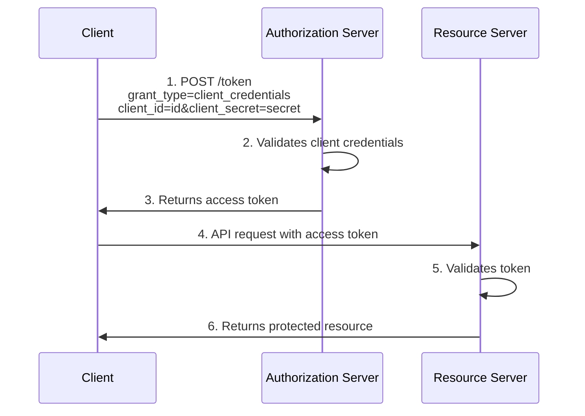
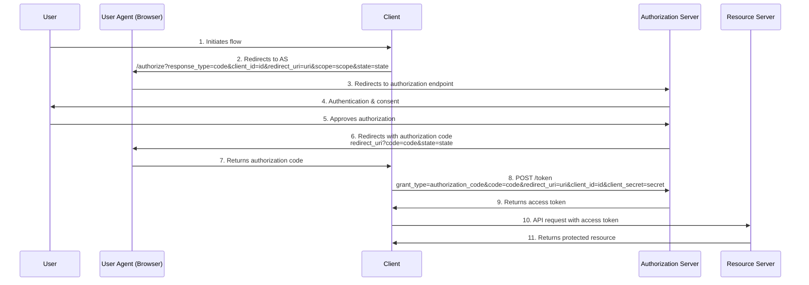
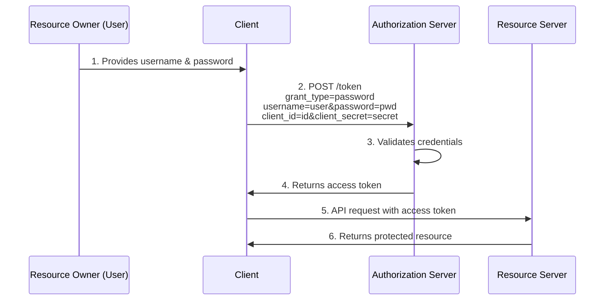

# OAuth 2.0 Grant Types Comparison

## Comparison Table

| Aspect | Client Credentials | Authorization Code | Resource Owner Password |
|--------|-------------------|-------------------|------------------------|
| **Flow Type** | Machine-to-machine | User-centric with redirection | Direct user credentials |
| **User Involvement** | None | Interactive consent | Provides credentials directly |
| **Client Type** | Confidential | Public or confidential | Confidential |
| **Token Delivery** | Direct to client | Via browser redirect | Direct to client |
| **Security Level** | High | Highest | Medium |
| **Use Cases** | Backend services, APIs | Web apps, mobile apps, SPAs | First-party apps with high trust |
| **User Credentials** | Not involved | Not exposed to client | Exposed to client |
| **Refresh Token** | Typically not issued | Commonly issued | Commonly issued |

## Flow Diagrams

### Client Credentials

### Authorization Code

### Resource Owner Password

## Key Differences

1. **Client Credentials**
   - No user involvement - purely for machine-to-machine communication
   - Client authenticates itself to get access to its own resources
   - Simplest flow with fewest steps
   - No refresh tokens typically issued

2. **Authorization Code**
   - Most secure flow with complete separation of concerns
   - User explicitly consents to authorization
   - Front-channel and back-channel communication
   - Supports PKCE extension for public clients
   - Most complex flow with most steps

3. **Resource Owner Password**
   - Client directly collects user credentials
   - No redirection or user consent UI
   - Requires high trust between user and client
   - Not recommended for third-party applications

## Recommendations

- **Client Credentials**: Use for service accounts, daemon processes, or backend-to-backend communication
- **Authorization Code**: Preferred for most user-facing applications, especially third-party applications
- **Resource Owner Password**: Use only for first-party applications with high trust, legacy systems, or when other flows aren't viable