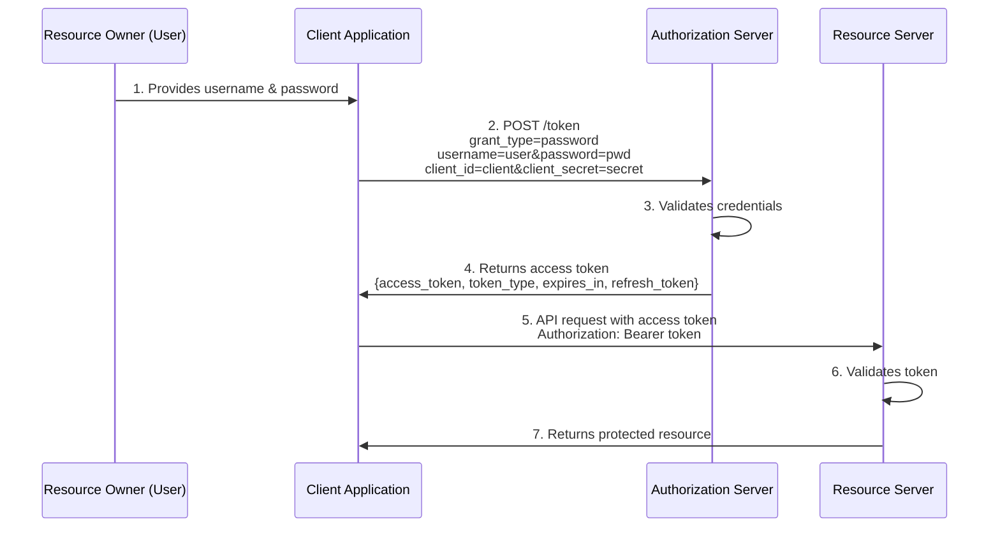

# Resource Owner Password Credentials Grant Flow

## Flow Description

1. **Resource Owner provides credentials**: The user provides their username and password directly to the client application.

2. **Token Request**: The client sends these credentials along with its own identification to the authorization server.

3. **Validation**: The authorization server validates the resource owner's credentials and the client's authentication.

4. **Token Response**: If valid, the authorization server issues an access token (and optionally a refresh token).

5. **Resource Request**: The client uses the access token to request the protected resource.

6. **Token Validation**: The resource server validates the access token.

7. **Resource Response**: If the token is valid, the resource server provides the requested resource.

## Important Notes

- This grant type should only be used when there is a high degree of trust between the resource owner and the client.
- The client must be capable of securely storing the resource owner's credentials.
- This flow is not recommended for third-party applications as it requires direct handling of user credentials.
- Modern applications typically prefer authorization code flow with PKCE for better security.